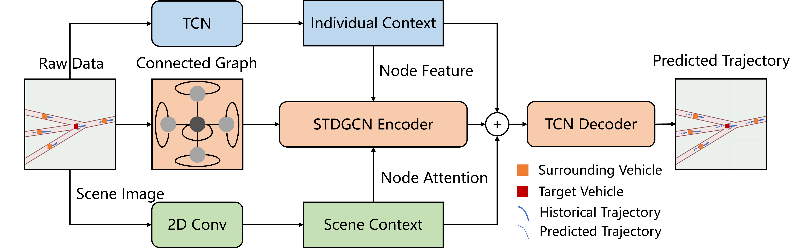
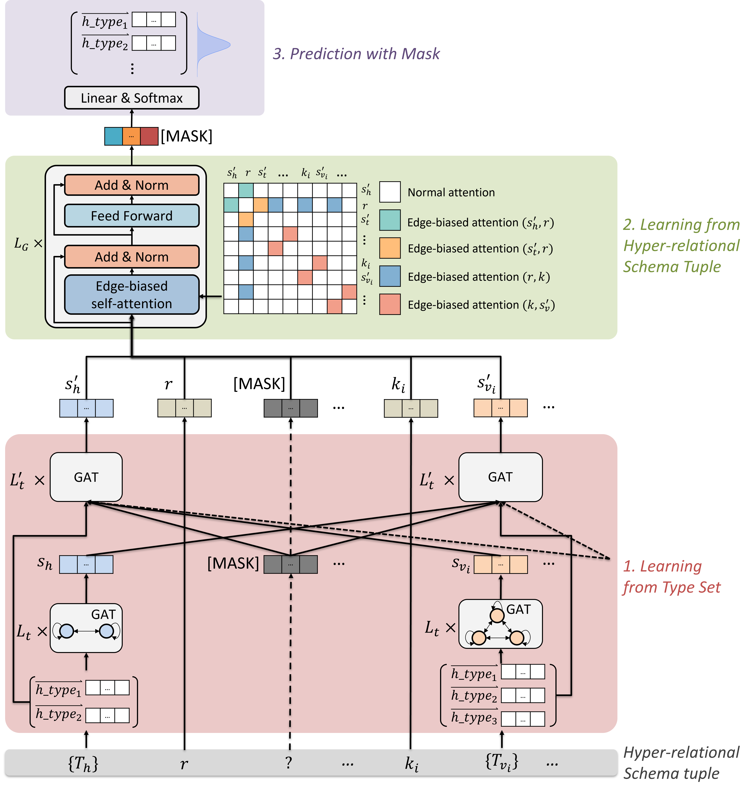
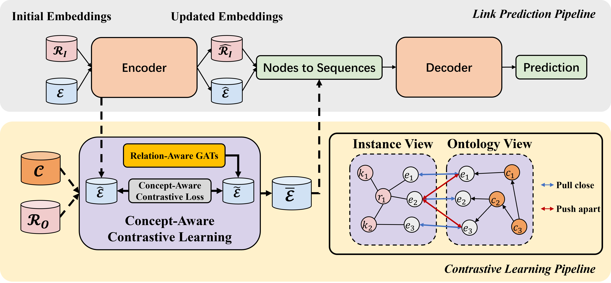
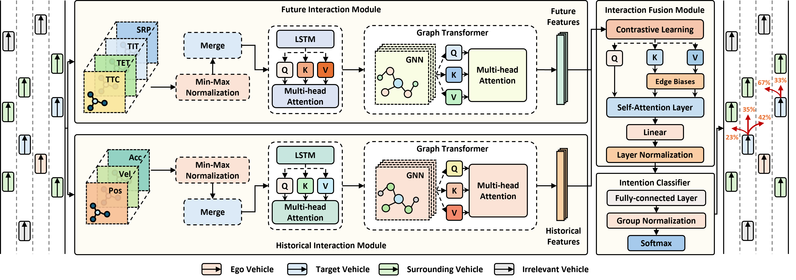
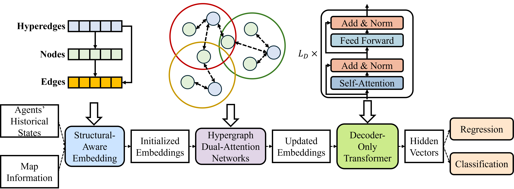
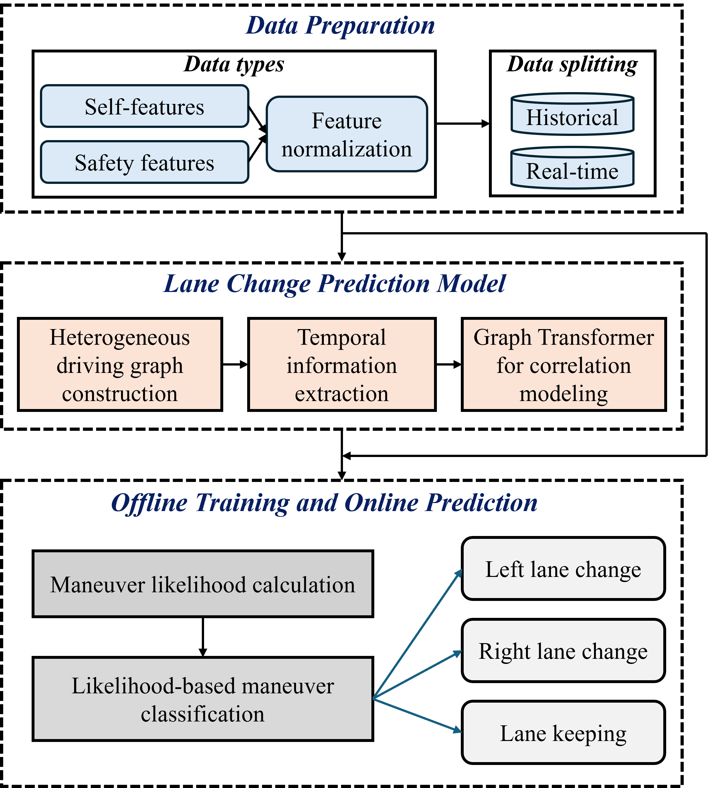
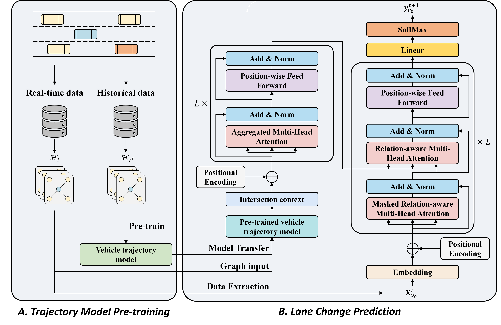

I am currently a PhD candidate at the [SKL-IOTSC](https://skliotsc.um.edu.mo/), working under the guidance of Prof. Dingqi Yang. I am also affiliated with the Department of Computer and Information Science at the University of Macau.

My research lies at the intersection of transportation, knowledge representation, and artificial intelligence (AI). I focus on developing algorithms and techniques that enable knowledge-driven transportation systems and autonomous driving. My interests span deep learning, reinforcement learning, and generative AI, with applications in prediction, recognition, decision-making, optimization, and human-machine interaction. To date, I have published over 30 papers in leading AI and intelligent transportation systems (ITS) journals and conferences.

# 🔥 News
- *2025.02*: &nbsp;🎉🎉 One paper has been accepted by IEEE T-ITS.
- *2024.12*: &nbsp;🎉🎉 One paper has been accepted by TR-C.
- *2024.12*: &nbsp;🎉🎉 One paper has been accepted by IEEE T-ITS.
- *2024.12*: &nbsp;🎉🎉 Two papers have been accepted by AAAI 2025.
- *2024.09*: &nbsp;🎉🎉 One paper has been accepted by IEEE T-ITS.
- *2024.09*: &nbsp;🎉🎉 One paper has been accepted by Information Fusion.
- *2024.05*: &nbsp;🎉🎉 One paper has been accepted by ACL 2024.
- *2024.05*: &nbsp;🎉🎉 One paper has been accepted by IEEE T-CSVT.
- *2023.09*: &nbsp;🎉🎉 One paper has been accepted by IEEE T-KDE.
- *2023.07*: &nbsp;🎉🎉 One paper has been accepted by ACMMM 2023.

# 📝 Publications 
## Highlights

**Schema-Aware Hyper-Relational Knowledge Graph Embeddings for Link Prediction**

Yuhuan Lu, Dingqi Yang, Pengyang Wang, Paolo Rosso, Philippe Cudre-Mauroux

**IEEE Transactions on Knowledge and Data Engineering, 2024**

[**Paper**](https://doi.org/10.1109/TKDE.2023.3323499)

- We propose sHINGE, a schema-aware hyper-relational KG embedding model, which learns from hyper-relational facts directly and their corresponding hyper-relational schema in a KG.

**Vehicle Trajectory Prediction in Connected Environments via Heterogeneous Context-Aware Graph Convolutional Networks**

Yuhuan Lu, Wei Wang, Xiping Hu, Pengpeng Xu, Shengwei Zhou, Ming Cai

**IEEE Transactions on Intelligent Transportation Systems, 2023**

[**Paper**](https://doi.org/10.1109/TITS.2022.3173944)

- We propose a novel Heterogeneous Context-Aware Graph Convolutional Networks following the Encoder-Decoder architecture, which simultaneously extracts the hidden contexts from individual historical trajectories, varying driving scenes, and inter-vehicle interactional behaviors.

**HELIOS: Hyper-Relational Schema Modeling from Knowledge Graphs**

Yuhuan Lu, Bangchao Deng, Weijian Yu, Dingqi Yang

**ACMMM, 2023**

[**Paper**](https://doi.org/10.1145/3581783.3612184)

- We propose HELIOS, a hyper-relational schema model designed to subtly learn from hyper-relational schema tuples by capturing not only the correlation between multiple types of a single entity, but also the correlation between types of different entities and relations in a schema tuple.

**HyperCL: A Contrastive Learning Framework for Hyper-Relational Knowledge Graph Embedding with Hierarchical Ontology**

Yuhuan Lu, Weijian Yu, Xin Jing, Dingqi Yang

**ACL, 2024**

[**Paper**](https://doi.org/10.18653/v1/2024.findings-acl.171)

- We propose a universal contrastive learning framework for hyper-relational KG embeddings (HyperCL), which is flexible to integrate different hyper-relational KG embedding methods and effectively boost their link prediction performance.

**Dual-View Interaction-Aware Lane Change Prediction for Autonomous Driving**

Yuhuan Lu, Zhen Zhang, Rufan Bai, Han Liu, Wei Wang

**AAAI, 2025**

[**Paper**](https://doi.org/10.1609/aaai.v39i27.35042)

- We propose to incorporate the concept of perceived safety into future interaction modeling and design a dual-view interaction-aware lane change prediction model.

**Hyper-Relational Interaction Modeling in Multi-Modal Trajectory Prediction for Intelligent Connected Vehicles in Smart Cities**

Yuhuan Lu, Wei Wang, Rufan Bai, Shengwei Zhou, Lalit Garg, Ali Kashif Bashir, Weiwei Jiang, Xiping Hu

**Information Fusion, 2025**

[**Paper**](https://doi.org/10.1016/j.inffus.2024.102682)

- We propose to model the hyper-relational interaction, which incorporates map elements into the inter-agent interaction. To tackle the hyper-relational interaction, we propose a novel Hyper-relational Multi-modal Trajectory Prediction (HyperMTP) approach.

**Knowledge-Driven Lane Change Prediction for Secure and Reliable Internet of Vehicles**

Yuhuan Lu, Zhen Zhang, Wei Wang, Yiting Zhu, Tiantian Chen, Yasser D Al-Otaibi, Ali Kashif Bashir, Xiping Hu

**IEEE Transactions on Intelligent Transportation Systems, 2025**

[**Paper**](https://doi.org/10.1109/TITS.2025.3526341)

- We propose to employ the knowledge-driven paradigm and design KLEP, a knowledge-driven lane change prediction framework. KLEP incorporates driving knowledge into lane change modeling, presenting the top-down hierarchical cognitive process of drivers when performing lane change maneuvers.

**Lane Change Prediction for Autonomous Driving With Transferred Trajectory Interaction**

Yuhuan Lu, Pengpeng Xu, Xinyu Jiang, Ali Kashif Bashir, Thippa Reddy Gadekallu, Wei Wang, Xiping Hu

**IEEE Transactions on Intelligent Transportation Systems, 2025**

[**Paper**](https://doi.org/10.1109/TITS.2025.3542517)

- We present a novel lane change prediction framework using Transformer-based transfer learning. Our design aims to leverage inter-vehicle interactions learned from trajectory data to improve lane-change prediction accuracy.

**Automatic Incident Detection Using Edge-Cloud Collaboration Based Deep Learning Scheme for Intelligent Transportation Systems**

Yuhuan Lu, Qinghai Lin, Haiyang Chi, Jin-Yong Chen

**Applied Intelligence, 2023**

[**Paper**](https://doi.org/10.1007/s10489-023-04673-7)

- We propose a novel automatic incident detection paradigm using an edge-cloud collaboration mechanism. In particular, a Spatio-Temporal Variational Digraph Auto-Encoder model is developed to distinguish the incidents in dynamic traffic flows.

**Dual Attentive Graph Neural Network for Metro Passenger Flow Prediction**

Yuhuan Lu, Hongliang Ding, Shiqian Ji, NN Sze, Zhaocheng He

**Neural Computing and Applications, 2021**

[**Paper**](https://doi.org/10.1007/s00521-021-05966-z)

- We develop a novel dual attentive graph neural network that can effectively predict the distribution of metro traffic flow considering the spatial and temporal influences.

# 🎖 Honors and Awards
- *2025.01* First Prize of Annual Academic Rising Star Award, Guangdong-Hong Kong-Macao Joint Laboratory for Emotional Intelligence and Pervasive Computing
- *2024.12* Ultimate Report Award, Southeast University
- *2021.08* UM PhD Assistantship, University of Macau
- *2017.12* Crowdsourcing Program Excellence Award, Key Laboratory of Road and Traffic Engineering of the Ministry of Education

# 📖 Educations
- *2021 - 2025*, Doctor of Philosophy, Computer Science, University of Macau, Macao 
- *2013 - 2017*, Bachelor of Science, Traffic Engineering, Sun Yat-Sen University, Guangzhou, China

# 📚 Academic Services
## Program Committee
- Artificial Intelligence for Social Impact Track, AAAI, 2025
- Web4Good Special Track, WWW, 2025
- AI and Social Good Special Track, IJCAI, 2025

## Journal Reviewer
- IEEE Transactions on Pattern Analysis and Machine Intelligence
- IEEE Transactions on Knowledge and Data Engineering
- IEEE Transactions on Intelligent Transportation Systems 
- IEEE Internet of Things Journal
- IEEE Transactions on Consumer Electronics
- Machine Intelligence Research
- Transportation Research Part C: Emerging Technologies
- Accident Analysis & Prevention
- IET Intelligent Transport Systems
- Transportation Research Record
