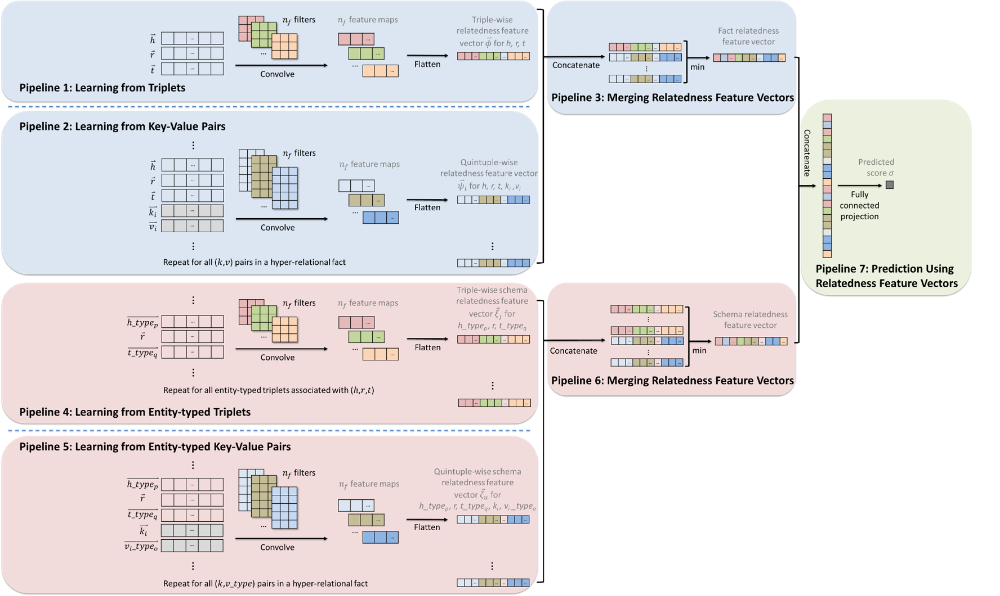

I am currently a PhD candidate at the [IOTSC](https://skliotsc.um.edu.mo/), working under the guidance of Prof. Dingqi Yang.

My research lies at the intersection of transportation, knowledge representation, and artificial intelligence (AI). I focus on developing algorithms and techniques that enable knowledge-driven transportation systems and autonomous driving. My interests span deep learning, reinforcement learning, and generative AI, with applications in prediction, recognition, decision-making, optimization, and human-machine interaction. To date, I have published over 30 papers in leading AI and intelligent transportation systems (ITS) journals and conferences.

# 🔥 News
- *2022.02*: &nbsp;🎉🎉 Lorem ipsum dolor sit amet, consectetur adipiscing elit. Vivamus ornare aliquet ipsum, ac tempus justo dapibus sit amet. 
- *2022.02*: &nbsp;🎉🎉 Lorem ipsum dolor sit amet, consectetur adipiscing elit. Vivamus ornare aliquet ipsum, ac tempus justo dapibus sit amet. 

# 📝 Publications 
## Highlights

**Schema-Aware Hyper-Relational Knowledge Graph Embeddings for Link Prediction**

Yuhuan Lu, Dingqi Yang, Pengyang Wang, Paolo Rosso, Philippe Cudre-Mauroux

**IEEE Transactions on Knowledge and Data Engineering, 2024**

[**Paper**](https://doi.org/10.1109/TKDE.2023.3323499)

- We propose sHINGE, a schema-aware hyper-relational KG embedding model, which learns from hyper-relational facts directly and their corresponding hyper-relational schema in a KG.

# 🎖 Honors and Awards
- *2021.10* Lorem ipsum dolor sit amet, consectetur adipiscing elit. Vivamus ornare aliquet ipsum, ac tempus justo dapibus sit amet. 
- *2021.09* Lorem ipsum dolor sit amet, consectetur adipiscing elit. Vivamus ornare aliquet ipsum, ac tempus justo dapibus sit amet. 

# 📖 Educations
- *2019.06 - 2022.04 (now)*, Lorem ipsum dolor sit amet, consectetur adipiscing elit. Vivamus ornare aliquet ipsum, ac tempus justo dapibus sit amet. 
- *2015.09 - 2019.06*, Lorem ipsum dolor sit amet, consectetur adipiscing elit. Vivamus ornare aliquet ipsum, ac tempus justo dapibus sit amet. 

# 💬 Invited Talks
- *2021.06*, Lorem ipsum dolor sit amet, consectetur adipiscing elit. Vivamus ornare aliquet ipsum, ac tempus justo dapibus sit amet. 
- *2021.03*, Lorem ipsum dolor sit amet, consectetur adipiscing elit. Vivamus ornare aliquet ipsum, ac tempus justo dapibus sit amet.  \| [\[video\]](https://github.com/)

# 💻 Internships
- *2019.05 - 2020.02*, [Lorem](https://github.com/), China.
